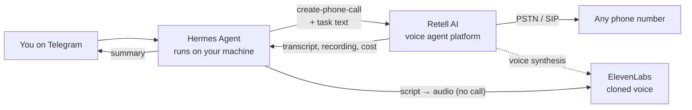

# hermes-voice-agent

**Give your AI assistant a phone line — with your own voice.**

An open-source blueprint for wiring [Hermes Agent](https://github.com/azimshaik/harness-architecture)
to a real phone system so you can say *"call the dentist and ask about Saturday"*
from Telegram and get a transcript, a summary, and a recording back.

Built and battle-tested on real calls: booking inquiries, family check-ins,
voicemail handling, screening services, and callers who ask the agent
unexpected questions mid-call.

## What you get

- **Outbound calls from a dedicated number** — the agent dials, talks, listens
- **Your cloned voice** — callers hear *you* (with an honest "your personal
  assistant" introduction — see [ETHICS.md](ETHICS.md))
- **Per-call instructions** — "ask about a table for four on Saturday" is
  injected into the agent's prompt for that call only
- **Transcripts, recordings, and cost per call** — retrieved by script
- **Telegram control** — you message Hermes from your phone; Hermes places the call

## Architecture



**Two ways to get your voice:**

| Path | Where | Cost | Use for |
|---|---|---|---|
| **Retell native clone** (simplest) | Retell `POST /clone-voice` | $0.04/min at call time | Calls |
| **ElevenLabs clone** (more control) | ElevenLabs `POST /v1/voices/add` | Starter plan ~$5/mo + credits | Calls *and* offline script→audio |

## Cost reality (verified on a live account)

| Component | Rate |
|---|---|
| Retell platform | $0/mo — pure pay-as-you-go |
| Voice engine + telephony | ~$0.07–0.09/min |
| Cloned voice (ElevenLabs engine) | $0.04/min |
| LLM brain | $0.006/min (Flash-Lite class) → $0.08/min (GPT-class) |
| **Realistic all-in** | **~$0.13–0.25/min** |
| Phone number | ~$2/mo |
| ElevenLabs (if cloning there) | free tier blocked → Starter ~$5/mo |

Measured on real calls from this repo's scripts: a 69-second call = **$0.15**,
a 40-second call = $0.12. See [docs/COSTS.md](docs/COSTS.md) for the full table
and the cost levers (the LLM is the only real dial — the voice is the product).

## Quickstart

```bash
git clone https://github.com/YOUR_USER/hermes-voice-agent && cd hermes-voice-agent
cp .env.example .env      # then fill in your keys (never commit this file)

python3 scripts/clone_voice.py samples/my_voice.m4a   # → voice_id
python3 scripts/create_prompt_agent.py                # → agent_id (prompts/)
python3 scripts/make_call.py "+1XXXXXXXXXX" "ask if they have a table Saturday for four"
python3 scripts/wait_call.py <call_id>                # transcript + recording + cost
```

Full walkthrough — accounts, KYC, number purchase, agent prompts, model picks,
troubleshooting — in **[docs/SETUP.md](docs/SETUP.md)**.

## Repository layout

| Path | What |
|---|---|
| `scripts/make_call.py` | Place an outbound call with a per-call task |
| `scripts/wait_call.py` | Wait for a call to end; save transcript + recording |
| `scripts/get_call.py` | Fetch a finished call |
| `scripts/clone_voice.py` | Clone a voice via Retell (ElevenLabs engine) |
| `scripts/create_prompt_agent.py` | Create the LLM + agent from `prompts/` |
| `scripts/tts.py` + `scripts/el_clone.py` | ElevenLabs: clone + offline script→audio |
| `prompts/assistant-agent.md` | The system prompt (identity, checklist, voicemail, holds) |
| `docs/SETUP.md` | Step-by-step setup |
| `docs/COSTS.md` | Verified pricing + cost levers |
| `docs/ARCHITECTURE.md` | How the pieces fit |
| `ETHICS.md` | Disclosure, impersonation rules, legality |

## The one rule that matters

The agent introduces itself as **your assistant** and never claims to be you,
and never pretends to be human if asked. It can *sound* like you; it must not
*lie* for you. Read [ETHICS.md](ETHICS.md) before you dial.

## Requirements

- Python 3.9+ (stdlib only — no pip installs)
- A Retell AI account (KYC required for numbers)
- Optional: ElevenLabs account (Starter) for offline TTS
- Optional: Hermes Agent for the Telegram control loop

## License

MIT — see [LICENSE](LICENSE).
